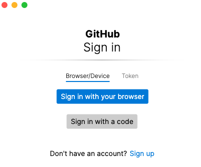

# Week 1 - Setting up the project environment (Mac)
The following setups are for a developer using a MacBook.

## Install VSCode
Download the App here: https://code.visualstudio.com

Move the app file to Applications so you could see it in the Mac Launcher.

## XCode toolkits on Macbook
You may need the Apple Command Line Tools Package to be able to use Git and other tools.
Follow this instruction to ensure XCode developer tools are installed:
https://apple.stackexchange.com/questions/254380/why-am-i-getting-an-invalid-active-developer-path-when-attempting-to-use-git-a
```
xcode-select --install
```

After installation, try running git by doing the next steps below.

## Setup local version of project repository
```
$ cd <your-selected-workspace-directory>
$ git clone https://github.com/AlfredAria/Adagio.git
```
For example, if I put my projects in `~/Documents/Workspace`, then by cloning, I will get my local project directory `~/Documents/Workspace/Adagio`

## IDE Preparation
Developing this project in VSCode is recommended.
1. Launch VSCode.
2. File -> Open Folder -> Select the `<path>/Adagio` directory that was created when you ran `git clone <project-name>`
3. Try to browse through the files `instructions.md`, `LICENSE` and `README.md` about this project.
4. Right click on `instructions.md` and select Open Preview. You should see a formatted view of this file same as on the Github page (assuming they are updated to the same version).

## Git authentication with `git-credential-manager-core`
1. Install `git-credential-manager-core` 
2. Follow instructions here to generate a personal access token:
 https://docs.github.com/en/enterprise-server@3.4/authentication/keeping-your-account-and-data-secure/creating-a-personal-access-token
3. To confirm that the token works, try running `$ git pull` in the repository folder `~/Documents/Workspace/Adagio`. When this little window below pop up, paste in the token you just generated.


## Introduction to Git
- Part 1: https://www.youtube.com/watch?v=9GKpbI1siow
- Part 2: https://www.youtube.com/watch?v=n-p1RUmdl9M
- Part 3: https://www.youtube.com/watch?v=UFEby2zo-9E
- Part 4: https://www.youtube.com/watch?v=ol_UCWox9kc

## Create a local branch for doing your work, and push it on Github
```
$ git checkout -b <branch-name>
$ git push --set-upstream origin -b <branch-name>
```