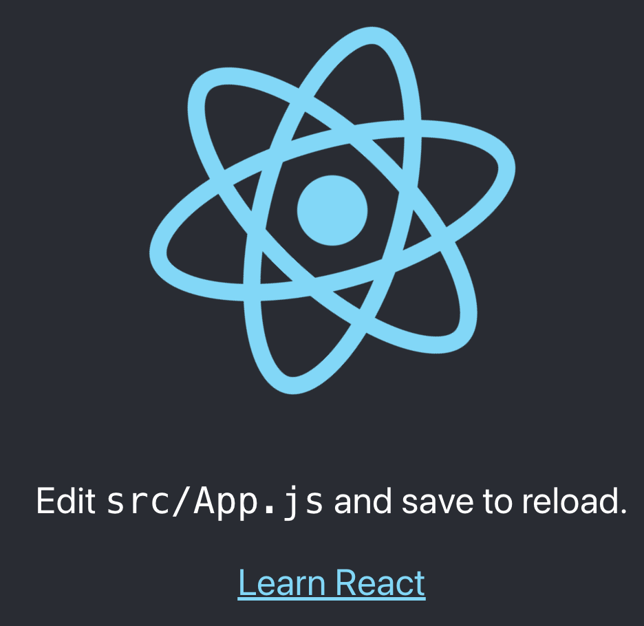
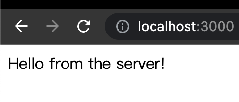
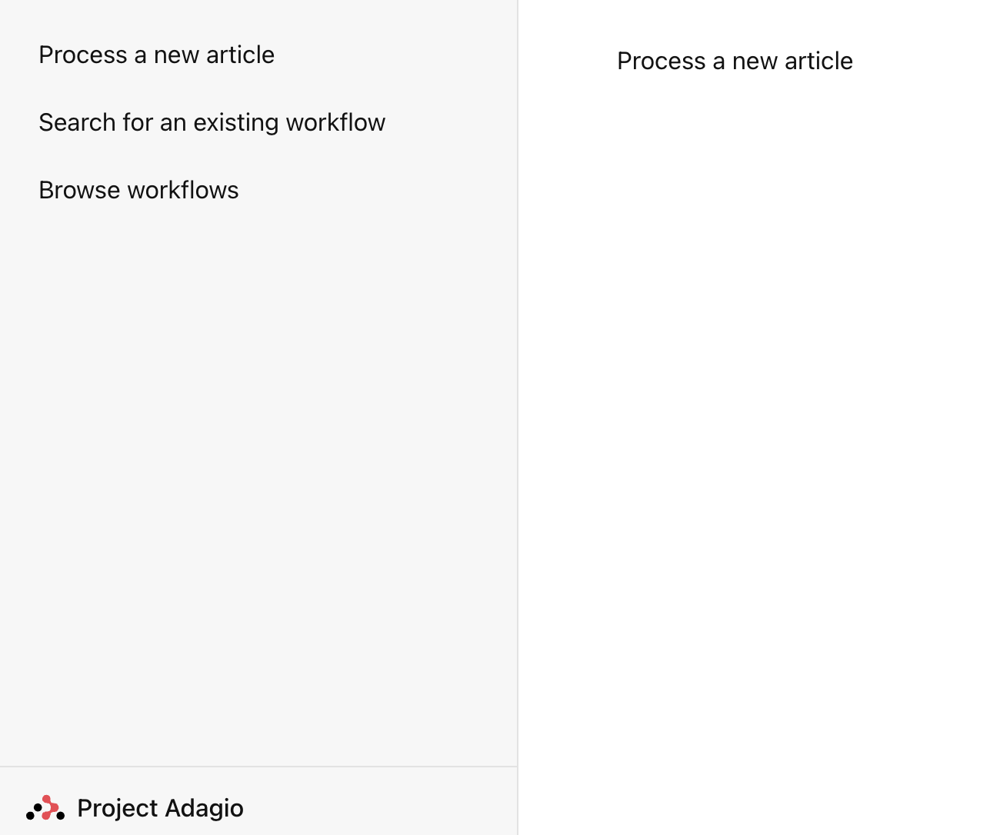

# Week 2 - (1) Getting demo to work locally

(TODO) What do you see when you run `node` in the command line? Maybe you will need to install Node.js first.

The files you can find in the `adagiostackserver` directory is the implementation of the `Backend` and the `Frontend` parts of the project. You don't need to configure the technologies used in the project but instead just finish some tasks on top of them.

The code implements our business logic but it does not include all the dependencies required to run a prototype demo. We need to install the node dependencies with the following commands:
```
npm install express
npm install react react-dom
```

For the first time you run the servers, you also need to run `npm install` to load the dependencies to your local workspace. Once it's done, you will see a directory `node_modules` in your `service` and your `web` folders.

Try to run the `Frontend` by navigating to the `adagiostackserver/web` directory and run `npm start`. Your browser will automatically launch pointing to the URL `http://localhost:4000/` and show a demo view like below:


Try to run the `Backend` by navigating to the `adagiostackserver/service` folder and run `node service.js`. Your browser will automatically launch pointing to the URL `http://localhost:3000/` and show a demo view like below:


The purpose of the Frontend Server is to show a browser view for users to interact with the product. We are locating our homepage to a special URL path (more to discuss in Week 3).

The purpose of the Backend Server is to supply data for the Frontend Server. The data are accessible via a few special URL patterns and parameters (more to discuss in following weeks).

# Week 2 - (2) Integrating a React Router

I applied a slightly modified version of the example on React Router to create the sidebar + content view of our App:
https://reactrouter.com/en/main/start/tutorial#url-params-in-loaders

