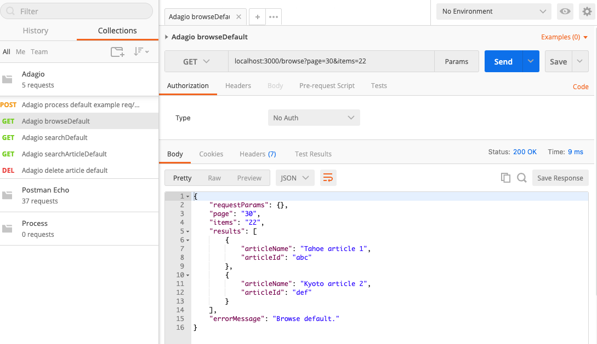

# Week 3 - Implementing RESTFul APIs

This week's focus is to implement some of the backend server APIs, but without attaching any other server processes or 3rd party APIs. Our backend is a Node.js/Express server that exposes RESTful APIs for viewing and manipulating the data stored. In the beginning, the APIs simply echoes the params from the request, some hardcorded data, plus returning a success state.

## Concepts and definitions
- RESTFul API
- HTTP Request
- HTTP Request Types (GET, POST, DELETE and more)
- HTTP Response
- HTTP Response Status Codes (200, 400, 500 and more)
- JSON

- HTTP URL
- HTTP URL params
- HTTP URL queries
- HTTP request body

[Postman](https://www.postman.com/downloads) is a handy tool to test backend APIs without starting a frontend UI server.

To start the Express server, simply browse to `Adagio/adagiostackserver/service` and run `$ node server.js`. The server will start listening on port `3000`.

Use Postman to build and save an example request. 